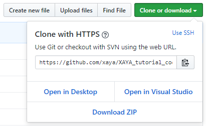

# XAYA Tutorial Code

This repository holds code for various XAYA tutorials.

Instead of separating code into multiple repositories, it is all consolidated here for the sake of simplicity. Simply browse to the proper folder for the code you wish to use. 

You can clone or download this entire repository to get the code in 1 convenient package.

